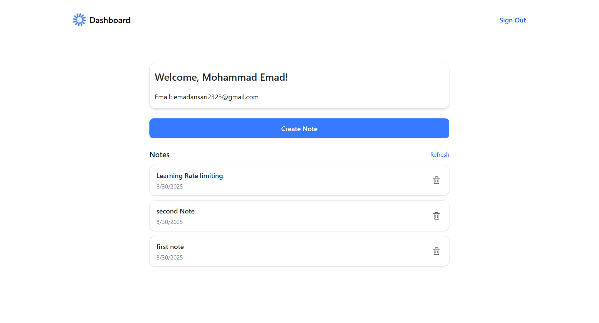
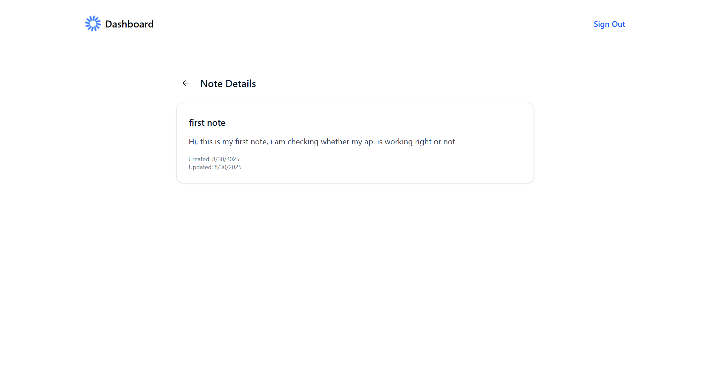

# 📒 Full Stack Note-Taking Application

A full-stack **note-taking application** built with **React (TypeScript), Express (TypeScript), and MongoDB Atlas**.
Users can sign up and log in using **Email + OTP authentication**, and once logged in, they can **create and delete personal notes** securely with **JWT authentication**.

---

## 🚀 Features

* 🔐 **User Authentication**

  * Sign up using **Email + OTP verification**
  * Secure **JWT-based login & authorization**
* 📝 **Notes Management**

  * Create personal notes
  * Delete notes
* 📱 **Responsive UI**

  * Mobile-friendly design closely following the provided assignment design
* ⚡ **Tech Stack**

  * **Frontend**: React (TypeScript), TailwindCSS, shadcn/ui
  * **Backend**: Express (TypeScript), JWT, Zod, MongoDB Atlas
  * **Database**: MongoDB Atlas (Cloud)
  * **Version Control**: Git & GitHub

---

## 📂 Project Structure

```bash
├── frontend/          # React (TypeScript) client
│   ├── src/
│   │   ├── components/ # Reusable UI components
│   │   ├── pages/      # Signup, Login, Dashboard
│   │   └── hooks/      # Custom hooks (e.g., useAuth)
│   └── ...
│
├── backend/           # Express (TypeScript) server
│   ├── src/
│   │   ├── config/     # DB connection, env setup
│   │   ├── models/     # User & Note schema
│   │   ├── routes/     # Auth & Note routes
│   │   └── middleware/ # Auth middleware (JWT)
│   └── ...
│
└── README.md
```

---

## ⚙️ Setup Instructions

### 1️⃣ Clone Repository

```bash
git clone https://github.com/emad-ansari/hd-note-app.git
cd note-app
```

### 2️⃣ Setup Backend

```bash
cd backend
npm install
```

Create a `.env` file in the **backend** folder:

```env
PORT=4000
MONGO_URI=your_mongodb_connection_string
JWT_SECRET=your_secret_key
```

Start the backend server:

```bash
npm run dev
```

### 3️⃣ Setup Frontend

```bash
cd frontend
npm install
```

Start the frontend development server:

```bash
npm run dev
```

### 4️⃣ Access App

Open [http://localhost:5173](http://localhost:5173) in your browser.

---

## 🖼️ Screenshots

👉 Replace placeholders below with your actual screenshots.

### 🔹 Signup Page


### 🔹 Login Page


### 🔹 Dashboard



### 🔹 Note Detail



---

## 🔑 Authentication Flow

1. User enters **email, username, and date of birth**
2. OTP is sent via backend (mock / email service)
3. On verification, user is stored in **MongoDB**
4. On login, server issues a **JWT token**
5. JWT is used to authorize **create & delete notes** requests

---

## 🌐 Deployment

* **Frontend**: Vercel
* **Backend**: Vercel
* **Database**: MongoDB Atlas (Cloud)

Live Demo: [https://hd-note-app-rosy.vercel.app/](https://hd-note-app-rosy.vercel.app/)

---

## 📌 Assignment Notes

* Completed within **3 days** as required
* Each feature committed step by step
* Supports **Email + OTP Authentication** (Google Sign-In skipped as per option)
* JWT used for secure note operations

---

👉 Do you want me to also **add instructions for running with Docker** (optional but looks professional in README), or keep it simple for your assignment?
